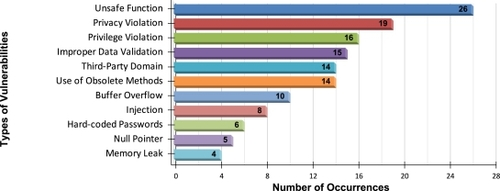

# IoT & Security Seminar

## Topic

1. Static analysis with focus on using language models and Hoare logic

## Use of AI

Used Perplexity for research (i.e. finding papers).

Used ChatGPT and Claude to suggest a finer outline: https://claude.ai/share/a1e3b8b4-a6da-4b14-85c9-6de0babfcf5e

## Sources

1. https://github.com/emmanuelsearch/some-iot-and-security-papers
2. Template for Seminar
3. Papers below

### Papers

1. [Static Code Analysis for IoT Security: A Systematic Literature Review (2025)](https://dl.acm.org/doi/full/10.1145/3745019)
   [Paper](3745019.pdf)
   - Authors: Diego Gomes, Eduardo Felix, Fernando Aires, Marco Vieira
   - Published: ACM Computing Surveys, Volume 58, Issue 3, 10th of September 2025
   - Summary: It is a meta-review, i.e. a review of 6 other recent literature reviews regarding static analysis for IoT:
     1. Xixing Li, Qiang Wei, Zehui Wu, and Wei Guo. 2023. A comprehensive survey of vulnerability detection method towards Linux-based IoT devices. In Proceedings of the 2023 2nd International Conference on Networks, Communications and Information Technology (CNCIT 2023). ACM, New York, NY, United States. https://dl.acm.org/doi/10.1016/j.cose.2023.103618
     2. Quoc-Dung Ngo, Huy-Trung Nguyen, Van-Hoang Le, and Doan-Hieu Nguyen. 2020. A survey of IoT malware and detection methods based on static features. ICT Express 6, 4 (Dec.2020), 280–286. https://doi.org/10.1016/j.icte.2020.04.005
     3. Abdullah Qasem, Paria Shirani, Mourad Debbabi, Lingyu Wang, Bernard Lebel, and Basile L. Agba. 2021. Automatic vulnerability detection in embedded devices and firmware: Survey and layered taxonomies. ACM Computing Surveys 54, 2 (March2021), 1–42. https://dl.acm.org/doi/10.1145/3432893
     4. Panjun Sun, Yi Wan, Zongda Wu, Zhaoxi Fang, and Qi Li. 2025. A survey on privacy and security issues in IoT-based environments: Technologies, protection measures and future directions. Computers & Security 148, C (Jan.2025), 104097. https://dl.acm.org/doi/full/10.1145/3745019#core-Bib0115-1
     5. Xiangyan Tang, Ke Zhou, Jieren Cheng, Hui Li, and Yuming Yuan. 2021. The Vulnerabilities in Smart Contracts: A Survey. Springer International Publishing, Dublin, Ireland. https://doi.org/10.1007/978-3-030-78621-2
     6. Wei Xie, Yikun Jiang, Yong Tang, Ning Ding, and Yuanming Gao. 2017. Vulnerability detection in IoT firmware: A survey. In Proceedings of the 2017 IEEE 23rd International Conference on Parallel and Distributed Systems (ICPADS), Vol. 51 9. IEEE, 769–772. https://doi.org/10.1109/icpads.2017.00104

     #### Results
     1. Vulnerabilities found through static analysis. 
     2. Static Analysis techniques
        1. Flow analysis
           - control flow analysis
           - data flow analyis
           - taint analysis
           - points-to analysis
        2. Code level
           - lexical analysis
           - syntax analysis
           - semantic analysis
           - symbolic analysis
        - other
        3. Classical
           - e.g. building an AST, following flows
        4. ML
           - NLP: LSTMs, POS-tagging, Word2Vec, TF-IDF, SVMs, LLMs, BERT, random forests, (gradient boosted) decision trees, KNN, logistic regression,
     3. Challenges of static analysis
        - Fundamentally, static analysis cannot find everything due to the theoretical Halteproblem limitation
        - Hardware, firmware and native libraries stay opaque
        -

2. [Static Analysis of Information Systems for IoT Cyber Security: A Survey of Machine Learning Approaches](https://www.mdpi.com/1491468)
   - Authors: Igor Kotenko, Konstantin Izrailov, Mikhail Buinevich
   - Published: Sensors 22, no. 4: 1335, 10th of February 2022
   - Summary: It is a meta-review of 7 other reviews on IoTS (IoT Security)
   1. Source code: Allamanis, M.; Barr, E.; Devanbu, P.; Sutton, C. A Survey of Machine Learning for Big Code and Naturalness. ACM Comput. Surv. 2017, 51, 36.
   2. Binary code: Xue, H.; Sun, S.; Venkataramani, G.; Lan, T. Machine Learning-Based Analysis of Program Binaries: A Comprehensive Study. IEEE Access 2019, 7, 65889–65912.
   3. Machine code: Ghaffarian, S.; Shahriari, H.R. Software Vulnerability Analysis and Discovery Using Machine-Learning and Data-Mining Techniques: A Survey. ACM Comput. Surv. 2017, 50, 1–36.
   4. Networks: Kotenko, I.; Saenko, I.; Kushnerevich, A.; Branitskiy, A. Attack Detection in IoT Critical Infrastructures: A Machine Learning and Big Data Processing Approach. In Proceedings of the 27th Euromicro International Conference on Parallel, Distributed and Network-Based Processing (PDP), Pavia, Italy, 13–15 February 2019; pp. 340–347.
   5. Distributed systems: Mescheryakov, S.; Shchemelinin, D.; Izrailov, K.; Pokussov, V. Digital Cloud Environment: Present Challenges and Future Forecast. Future Internet 2020, 12, 82.
   6. Distributed systems: Fu, X.; Li, X.; Zhu, Y.; Wang, L.; Goh, R.S.M. An intelligent analysis and prediction model for on-demand cloud computing systems. In Proceedings of the International Joint Conference on Neural Networks, Beijing, China, 6–11 July 2014; IEEE: Beijing, China, 2014; pp. 1036–1041.
   7. Anomaly detection: Ardulov, Y.; Kucherova, K.; Mescheryakov, S.; Shchemelinin, D. Self-learning Machine Method for Anomaly Detection in Real Time Data. In Proceedings of the 10th International Congress on Ultra Modern Telecommunications and Control Systems and Workshops (ICUMT), Moscow, Russia, 5–9 November 2018; pp. 1–5.

   #### Method
   1. The method of choice is to find the best ML method for each of a set of tasks.

   #### Results
   1. ML tasks:
      1. Classification
      1. Anomaly detection
      1. Regression
      1. Clustering
      1. Generalization: dimensionality reduction

   Skipped further reading because I think it is past the topic, but seems interesting anyway

3. [Static analysis for discovering IoT vulnerabilities](https://dl.acm.org/doi/abs/10.1007/s10009-020-00592-x)  
   [Paper](s10009-020-00592-x.pdf)
   - Authors: Pietro Ferrera, Amit Kr Mandal, Agostino Cortesi, Fausto Spoto
   - Published: International Journal on Software Tools for Technology Transfer, Volume 23, Issue 1, Pages 71 - 88 https://doi.org/10.1007/s10009-020-00592-x, 1st February 2021

   - Summary: Extends the industrial analyser Julia to detect the OWASP Top 10 vulnerabilities in IoT devices.

   Skipped further reading because it is cited by 1.

4. [Toward Secure and Reliable IoT Systems: A Comprehensive Review of Formal Methods Applications](https://ieeexplore.ieee.org/stamp/stamp.jsp?arnumber=10756658)  
   [Paper](Toward_Secure_and_Reliable_IoT_Systems_A_Comprehensive_Review_of_Formal_Methods_Applications.pdf)
   - Authors: Ikram Haddou-Oumouloud, Abderahman Kriouile, Soufiane Hamida, Ahmed Ettalbi
   - Published: IEEE Access PP(99): 1-1, Jan 2024

   - Summary: Meta-study of 35 Key Studies on Formal Approaches in IoT Systems
      1. Formal specification languages analysed: Z, VDM, B 
         1. Z: sequential, property, and model oriented
         2. B: model oriented
         3. VDM: process and model oriented
   
   #### Results
   1. Gaps: Scalability, Real-Time Performance, Cooperation between Formal Methods, Adaptability, Lack of Focus on Security & Privacy ?, Usability, 

### Stuff for the introduction

1. IoT market growing. https://www.statista.com/outlook/tmo/internet-of-things/worldwide, According to Gartner, by 2020, more
   than 25% of cyber-attacks on enterprises will target IoT sys-
   tems [39].
2. Why are static analysis and formal verification essential?
3. Difference between static and dynamic analysis -> Halteproblem
4. IoT definition

5. AI + formal modelling/static analysis is a strong combination -> LLMs are non-deterministic, a strong deterministic engine gives them grounding and a tight feedback loop  
   Formal modelling can be very tedious -> It is often not used -> AI can make it much easier by doing the bulk of the work

## Outline

Title: Static IoT Code Analysis: Challenges, Solutions and Gaps

1. Introduction: Motivation, scope, structure
2. Static Code Analysis Methods (Width coverage)
3. Hoare logic (Depth coverage)
4. Discussion: Challenges & Gaps
5. Conclusion

### Finer Outline

1. Introduction (1 page)
   - IoT and IoT Security
      - OWASP stats
   - Why static analysis, why LLMs?
   - Scope, research questions
   - Roadmap
2. Background and Methods (2 pages)
   - 
   - Rust
3. Formal methods (4 pages)
   - Introduction: classical static analysis finds symptoms; formal methods prove properties
      Formal modeling and formal verification
   - Overview of methods
   - Limitation: annotation complexity -> leads to 4
4. LLM (2 pages)
5. Discussion (2 pages)
6. Conclusion (1 pages)

## Ideas

1. how does Rust help
2. AI: claude 5 and AISLE
3.
